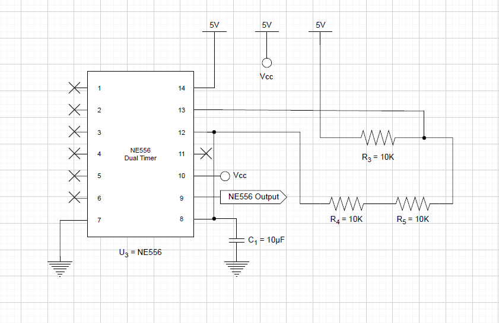
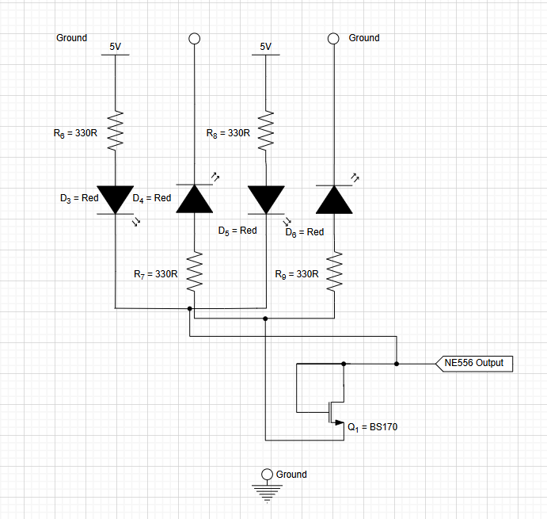

## Context

Traffic light subsystem 4 circuit in unit ENG1013 included a warning light section (WL2). A 556 timer was intended to generate flashing lights in patterns XOXO/OXOX alternately using four red LEDs, which were arranged in two parallel pairs across two separate branches. However, upon power-up, all LEDs illuminated simultaneously at an approximately equal brightness.

## Investigation

1. Checked the values of resistors and capacitor connected to the 556 timer:
  - For $R_A$ = $R_3$ and $R_B$ = $R_4$ + $R_5$, their values were $R_3$ = $R_4$ = $R_5$ = 10 kΩ, and $C_1$ = 10 μF, therefore period = 0.3465 s, which was sufficient to produce visible flashing.
  - The 556 timer section was reviewed and confirmed that it was correctly connected to the positive and negative rails.
  - The WL2 section was analysed, and it was identified that both parallel branches had an identical configuration. This was therefore the root cause.

The configuration of the 556 timer ($U_3$) with resistors $R_3$, $R_4$, $R_5$ and capacitor $C_1$.
## Root Cause

Each branch of WL2 consisted of two identically configured "LED + resistor" strings connected in parallel. Each red LED was labelled with D- and each resistor (330 Ω) was labelled with R-.

- Branch 1: Output → (D4 + R7) || (D6 + R9) → GND
- Branch 2: Output → (D3 + R6) || (D5 + R8) → GND

During charging of the capacitor (C1), the lower comparator (inside Timer B of 556 timer) output HIGH to input S of flip-flop, thus state of Q = HIGH, signaling to the Output Driver behind the Output pin to open the path for the current.

Since both branches shared the same nodes at both ends (between Output pin and GND), all the LEDs illuminated simultaneously.

Internal block diagram of a 555 timer (Timer A/B of the 556). Reproduced from Horowitz & Hill, *The Art of Electronics*, 3rd ed., 2015, p. 428.

## Fix #1

1. **Swapped the positions of each of the LEDs and their adjacent resistors in branch 2.**
2. **Disconnected branch 2 to GND and reconnected to positive rail (5V).**

As the voltage in C1 crossed 2/3 of 5 V, discharging started, Q went LOW, signaling the Output Driver to block the path between 5V and Output, and open the path between GND and Output. Current then flowed from the 5 V rail into Branch 2, turning on its LEDs, then continued into the Output pin to ground. Branch 1 was turned off since both sides equaled 0V; thus, current = 0 A. 

However, since the internal transistor inside the Output Driver still needed a small voltage to turn on and pulled the Output pin low, there was a voltage residue remained relative to ground, leading to a dim light in D4 and D6.

## Fix #2

1. **Connected an NMOS transistor (BS170) to branch 1**.

This solved the light dimming issue by using the transistor's threshold voltage (~2.0 V) to block the current path; therefore, when the node voltages in both sides were identical (5 V), the voltage difference equaled 0 V, current was 0 A. As a result, the D4 and D6 turned off.

Final configuration of the WL2 subcircuit with the NMOS transistor (BS170).
## Lesson

- LEDs only blink alternately when they are configured in such a way that the flow of current is opposite.
- Adding an NMOS transistor can block the current path if the gate-source voltage is below the threshold voltage.